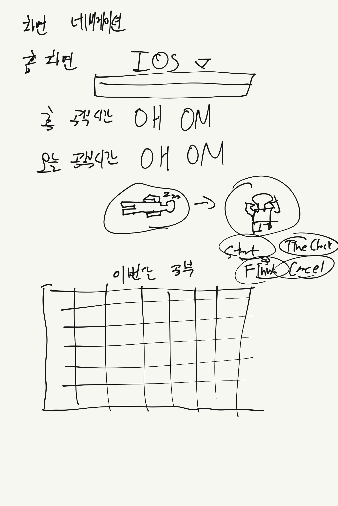

# BeExpert 개발일지
## 2023.02.18
- BeExpert 리포지토리 생성     
- UI 구상      

     
## 2023.03.04    
- App Icon 완성   
- Figma로 디자인 제작    
- App Icon Generator로 사이즈 별로 이미지 다운로드 완료     

- 참고자료
    - [Figma](https://www.figma.com)     
        - 앱 아이콘 디자인 사이트     
    - [App Icon Generator](https://www.appicon.co/)      
        - 앱 아이콘 사이즈별로 자동 생성 사이트     
    - [색상표](http://www.n2n.pe.kr/lev-1/color.htm)     
        - 앱에 일관된 색상 적용을 위한 색상 표
    
    
## 2023.03.05    
- View     
    - Storyboard로 그림    
- UIKit     
    - CollectionView 사용    
- 데이터 베이스: Realm 사용      
- 서버: 사용 계획 X
    
- Home 화면     
    - ScrollView로 제작     
        - ScrollView 내에 TableView 안에 넣지 말기(HIG에 따르면 같은 방향 스크롤뷰 중첩해서 넣는 것을 지양)       
    - 달력     
        - FSCalendar 오픈소스 라이브러리 커스텀하여 사용     
        
        
## 2023.03.06 
- Timer 기능 적용     

- 참고자료       
[Timer 튜토리얼](https://wiwi-pe.tistory.com/42)      


## 2023.03.08    
- Home 화면 수정     
    - ScrollView + TableView -> TableView + TableView HeaderView, FooterView      
        - 이유 
            - 문제발생: ScrollView 내에 TableView를 넣어 시간을 보여주려 했으나 여러 문제 발생      
                - 1. TableView도 ScrollView를 상속하여 만든 클래스여서 스크롤 이슈 발생할 수 있음     
                - 2. TableView Cell이 아닌, TableView 자체의 높이를 cell의 갯수에 따라 동적으로 변경하는 것의 어려움      
                - 3. 대부분의 자료가 TableView Cell의 dynamic height를 제어하는 것으로 이루어져 있고, TableView 자체의 높이를 동적으로 제어하는 것은 비추천함     
                - 해결      
                    - 1. ScrollView 제거 후 TableView 내에 모든 UI 위치함     
                    - 2. cell을 제외한 UI는 headerView, footerView에 UI 위치함     
- 참고자료     
[scrollView 내에 tableView 넣으면 안 되는 이유 - 야곰](https://yagom.net/forums/topic/scrollview%EC%95%88%EC%97%90-tableview%EA%B0%80-%EC%9E%88%EC%9D%84%EB%95%8C-%EC%8A%A4%ED%81%AC%EB%A1%A4-%EB%AC%B8%EC%A0%9C/)
[scollView 대신 tableView의 headerView와 footerView 사용한 이유](https://yagom.net/forums/topic/uitableview-%EB%86%92%EC%9D%B4%EB%A5%BC-%EB%8F%99%EC%A0%81%EC%9C%BC%EB%A1%9C-%EC%A7%80%EC%A0%95%ED%95%98%EB%8A%94-%EB%B2%95cell-%EB%86%92%EC%9D%B4%EA%B0%80-%EC%95%84%EB%8B%8C-tableview-%EB%86%92/)
[스토리보드로 tableView의 headerView, footerView 넣기](https://programmingwithswift.com/how-to-add-header-footer-view-in-uitableview-in-storyboard/)       
[코드로 tableView의 headerView 넣기 1](https://velog.io/@minni/Custom-TableViewHeaderView-%EC%83%9D%EC%84%B1%ED%95%98%EA%B8%B0)      
[코드로 tableView의 headerView 넣기 2](https://velog.io/@dvhuni/UITableView-Header-Footer-View-%ED%95%9C%EB%B2%88%EC%97%90-%EB%A7%8C%EB%93%A4%EA%B8%B0)     
    
    
- 총 공부한 시간 저장 기능 추가     
     
    
-  TableView Cell에 현재 시간 Label 추가      
    - 문제 발생: TableView의 currentTimeLabel에 현재 시간 데이터 넣는 문제     
        - 해결     
            - 1. TableView의 DataSource 처리하는 부분에서 currentTimeLabel 데이터 할당      
            
- 참고자료     
[현재시간 데이터 사용](https://ppomelo.tistory.com/18)      
     
     
- FSCalendar로 공부 시간 달력 만들기      
    - cocoaPods로 FSCalendar 라이브러리 설치     

[cocoaPods 사용방법 1](https://velog.io/@kerri/Xcode-CocoaPods%EC%BD%94%EC%BD%94%EC%95%84%ED%8C%9F-%EC%84%A4%EC%B9%98-%EB%B0%8F-%EC%82%AC%EC%9A%A9-%EB%B0%A9%EB%B2%95)

    
## 2023.03.17
- FSCalendar를 TableView Footer 부분에 추가    
    
- FSCalendar 커스터마이징 진행     
    - 문제 발생: TableView Cell의 Content View의 높이에 제약을 주지 않아서 경고 발생    
        ```swift
        [Warning] Warning once only: Detected a case where constraints ambiguously suggest a height of zero for a table view cell's content view.
         We're considering the collapse unintentional and using standard height instead.
         [경고] 경고 1회만 : 테이블 보기 셀의 콘텐츠 보기에 대해 제약 조건이 0의 높이를 모호하게 제시하는 경우를 탐지했습니다. 
         우리는 의도하지 않은 붕괴를 고려하고 대신 표준 높이를 사용하고 있습니다.
        ```
            - 해결     
            ```swift
            Chat GPT로 문제 해결 해봄
            이 에러는 UITableViewCell에서 컨텐츠 뷰(content view)의 높이가 0으로 설정되는 모호한(constraints ambiguously suggest) 제안을 발견했을 때 발생합니다.
             이러한 제안은 UITableViewCell의 높이를 제대로 계산할 수 없게 만듭니다.
            이 문제를 해결하는 가장 간단한 방법은 UITableViewCell의 높이를 명시적으로 설정하는 것입니다.
            이를 위해서는 UITableView의 heightForRowAt 델리게이트 메서드를 구현하여 각 셀의 높이를 반환해주면 됩니다.
            만약 모든 셀의 높이가 같다면, UITableView의 rowHeight 프로퍼티를 설정하여 간단하게 해결할 수 있습니다.
            
            // 모든 셀의 높이가 동일한 경우
            // TableViewDelegate 프로토콜을 따르는 클래스 내부에 다음과 같은 delegate method 선언
            
            func tableView(_ tableView: UITableView, heightForRowAt indexPath: IndexPath) -> CGFloat {
            return 100
            }
            
            해결 완료!
            ```
            
    - 오늘 공부한 시간에 따라 달력의 날짜 배경색 변경    
        - 테스트    
            - 1. finishButton() 내부에 calendar.reloadData()로 이 버튼이 눌려서 총 시간이 증가하면 calendar의 데이터 업데이트     
            - 2. func calendar(_ calendar: FSCalendar, appearance: FSCalendarAppearance, fillDefaultColorFor date: Date) -> UIColor?     
                이 메서드에 총 시간의 데이터를 전달하여, 총 시간량에 따라 조건을 세워서 날짜 데이터의 색상 변화시킴     
            - 이제 해야 할 일    
                - 1. 각 날마다 총 시간량을 저장
                - 2. Realm 모바일 데이터베이스를 이용하여, 1) 날짜, 2) 날짜별 총 시간량 저장    
                - 3. 오늘 날짜 객체를 생성하여 이용     
         
        - Realm으로 날짜별로 공부한 시간 저장해보기     
            
            

- FSCalendar 커스터마이징 완료      
    

    
